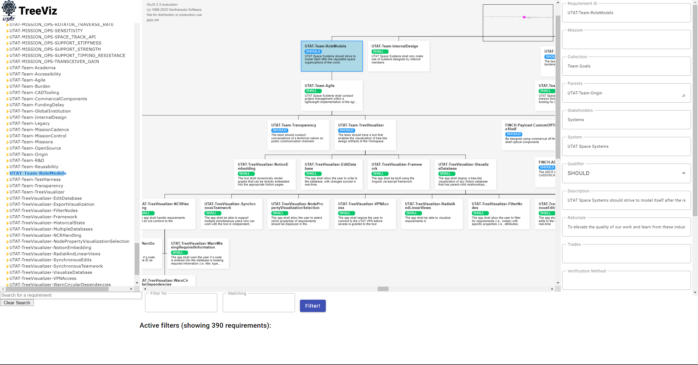

# TreeViz
An interactive requirements engineering tool. TreeViz makes working with requirement models more approachable by visualizing parent and child relationships as a graph. It connects to the team's [requirements database](https://www.notion.so/utat-ss/b9c7195bd9fa414a97ee704f503a0e9f?v=0f0b8595c5a943f5b01190c34206415b&pvs=4).

Built by the [University of Toronto Aerospace Team](https://www.utat.ca/space-systems):milky_way:.

# Usage
1. Connect to the [UTAT VPN](https://www.notion.so/utat-ss/OpenVPN-db39f3bb05ab470688e540b9827473f7?pvs=4)
1. Navigate to [https://treeviz.in.utat.ca/](https://treeviz.in.utat.ca/) in your browser

See Notion [page](https://www.notion.so/utat-ss/TreeViz-78c65cf8e7af4b1ba30fc42d1922bc95?pvs=4)

# Development

## Setup
1. Install [Node](https://nodejs.org/en)
1. Run `npm install` within both the client and server folders
